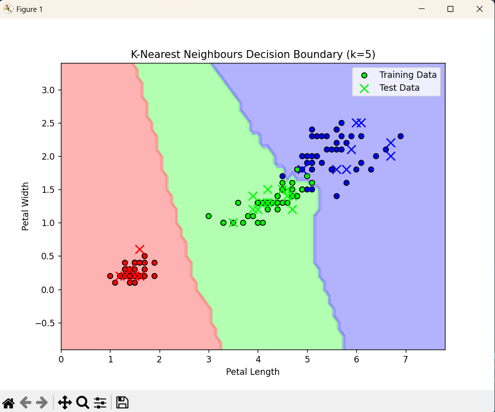
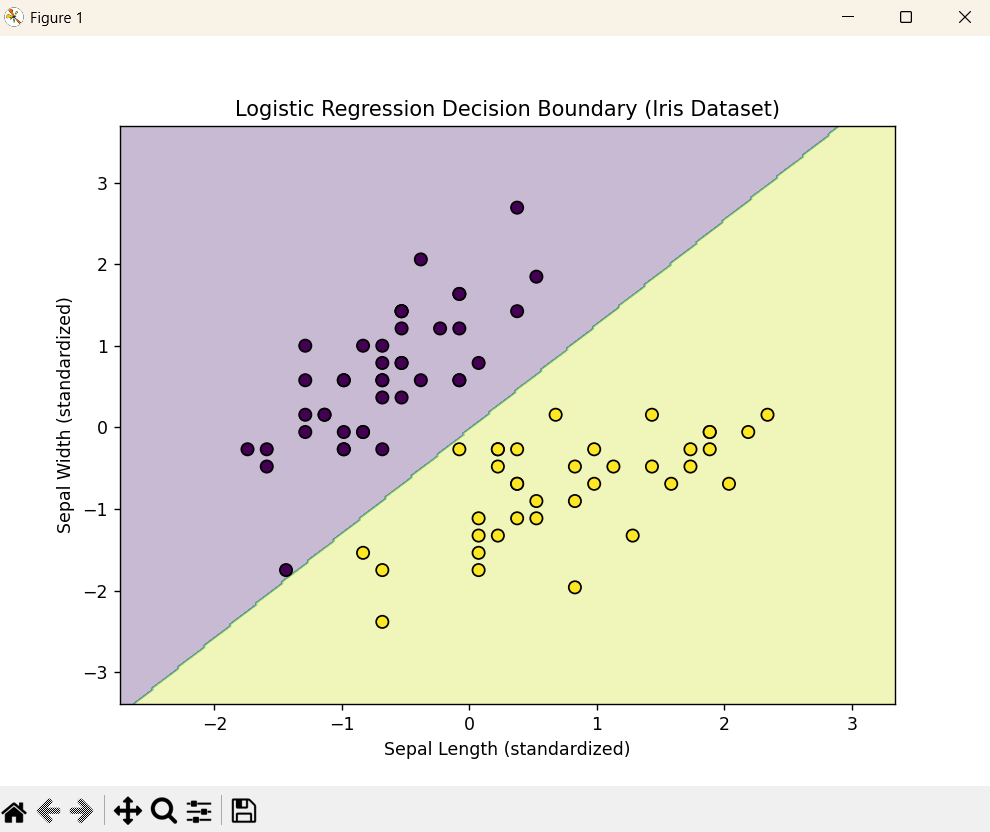
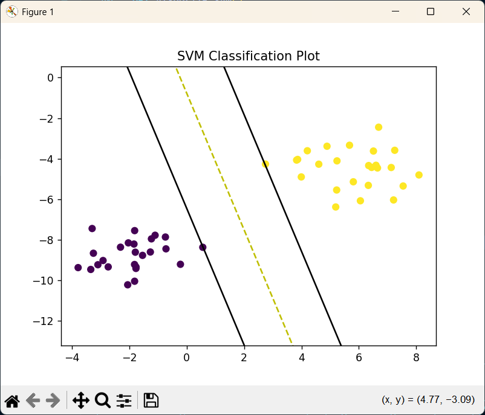
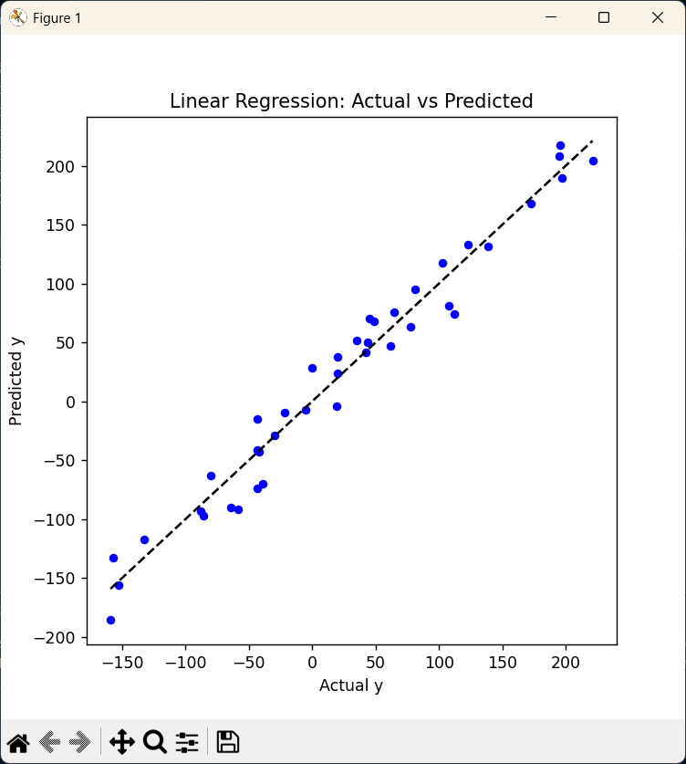
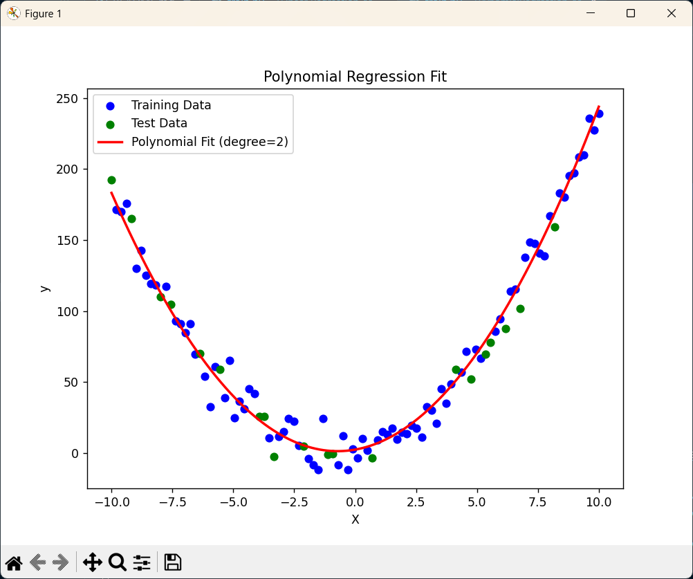

# MINI ML LIBRARY

Mini ML Library is a Python-based project that provides clean, modular, and educational implementations of core machine learning algorithms from scratch.  
The project is structured to clearly separate **classification** and **regression** techniques, emphasizing algorithmic understanding rather than black-box usage.

---

## Project Overview

Machine Learning libraries such as scikit-learn abstract away much of the internal logic behind popular algorithms.  
This repository focuses on implementing these algorithms manually to gain a deeper understanding of:

- Mathematical foundations of ML models
- Training and prediction workflows
- Model evaluation and behavior
- Clean and maintainable ML code structure

This project demonstrates strong fundamentals in **machine learning**, **Python programming**, and **algorithmic thinking**.

---

## Project Structure

---

## Algorithms Implemented

### Classification Techniques

#### 1. Decision Trees
Tree-based model that recursively splits data based on feature thresholds to perform classification.

**Key Concepts**
- Recursive splitting
- Depth control
- Decision rules

---

#### 2. K-Nearest Neighbours (KNN)
A distance-based algorithm that classifies samples based on the majority label of nearest data points.

**Key Concepts**
- Euclidean distance
- K value selection
- Majority voting

---

#### 3. Logistic Regression
A linear classification algorithm using the sigmoid activation function for binary classification.

**Key Concepts**
- Sigmoid function
- Binary cross-entropy loss
- Decision boundary

---

#### 4. Support Vector Machines (SVM)
A maximum-margin classifier that finds the optimal hyperplane separating classes.

**Key Concepts**
- Margin maximization
- Support vectors
- Linear decision boundary

---

### Regression Techniques

#### 5. Linear Regression
A regression algorithm that models the linear relationship between independent variables and a continuous target.

**Key Concepts**
- Mean Squared Error
- Gradient Descent
- Weight and bias optimization

---

#### 6. Polynomial Regression
An extension of linear regression that models non-linear relationships using polynomial features.

**Key Concepts**
- Feature expansion
- Underfitting vs overfitting
- Curve fitting

---

## Tech Stack

- **Python**
- **NumPy** – numerical computation
- **Matplotlib** – visualizations
- **scikit-learn** – datasets and data splitting
- **Standard Python tooling** – modular design and scripting

All dependencies are listed in `requirements.txt`.

---

## Skills Demonstrated

### Technical Skills
- Machine Learning algorithm implementation from scratch
- Data preprocessing and evaluation
- Numerical computing with NumPy
- Modular and scalable Python project structure

### Conceptual Understanding
- Classification vs Regression paradigms
- Loss functions and optimization
- Distance-based and tree-based learning
- Model complexity and generalization

---

## Future Enhancements

- Add more algorithms (Naive Bayes, Random Forests)
- Add performance metric visualizations
- Add overfitting and bias-variance analysis
- Add Jupyter notebook explanations
- Improve documentation and diagrams

---

## Author

**Vishank Tyagi**  
Engineering Student | Data Science & Machine Learning  
GitHub: https://github.com/VishankTyagi07

---

**Mini ML Library — Built to understand machine learning from first principles**
